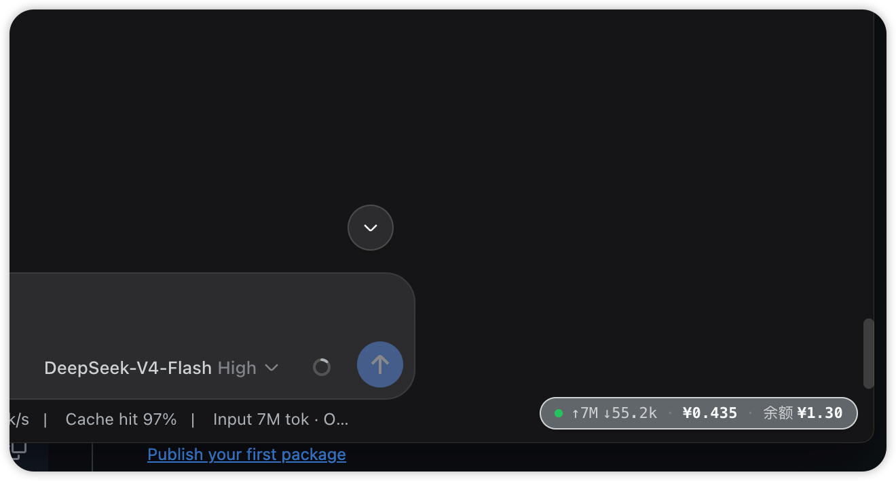

# dsh-codex-meter

Codex 风格的紧凑用量状态条（DSH web GUI 插件）。



一个极简的单行 monospace 胶囊，钉在 GUI 右下角，实时显示三项数据（英文标签）：

```
● S ¥0.52 · T ¥1.25 · B ¥1.07
```

| 段 | 含义 | 刷新 |
| --- | --- | --- |
| `●` | 状态点（绿=可用 / 红=错误） | — |
| `S ¥0.52` | 本会话费用（宿主回放会话日志，按官方价格表计价，含峰谷） | 15s（窗口可见时） |
| `T ¥1.25` | 今日已消费（配置平台 token 后为**官方数据**；否则 `≈` 本地估算） | 60s（随余额轮询） |
| `B ¥1.07` | DeepSeek API 剩余余额（官方 `/user/balance`，实时准确） | 60s |

特性：

- 点击胶囊：立即刷新
- **窗口隐藏/最小化时暂停轮询**，恢复可见立即补刷；数值无变化时不触发重渲染
- **平台 token 过期/失效时**，T 前显示黄色警示 `!`（`!T ≈¥X`），不会静默退回估算
- 只使用 `--dsw-*` 主题变量，跟随浅色 / 深色模式与应用字号缩放
- API Key 不出本机：浏览器只访问宿主本地路由

## 安装（桌面版手动方式）

本插件按 DSH 标准 bundle 插件设计（`dsh.bundle.patch` + `dsh.client`），正常可用 `dsh plugin --profile <name> add dsh-codex-meter` 安装。**桌面版**（DSH Desktop 2.x）的手动接线方式：

1. 将本包放入 profile 的 node_modules：

   ```sh
   PROFILE=~/.dsh/profiles/desktop
   mkdir -p "$PROFILE/node_modules"
   cp -R dsh-codex-meter "$PROFILE/node_modules/"
   ```

2. 桌面版 profile 的 node_modules 为空，插件的宿主依赖需软链到桌面自带 bundle：

   ```sh
   mkdir -p "$PROFILE/node_modules/@deepseek-ai"
   ln -sfn "/Applications/DSH Desktop.app/Contents/Resources/app.asar.unpacked/node_modules/@deepseek-ai/dsh-credentials" \
     "$PROFILE/node_modules/@deepseek-ai/dsh-credentials"
   ```

3. 在 `$PROFILE/cordis.patch.yml` 追加 loader 条目：

   ```yaml
   - insert:
       - id: codex-meter
         name: dsh-codex-meter
   ```

4. **完全重启 DSH Desktop**（退出再打开）。重启后右下角出现胶囊。

> 若用 CLI 版 `dsh web`：profile 自带完整 pnpm workspace，直接
> `dsh plugin --profile web add dsh-codex-meter` 即可，无需手动接线。

## 配置

- 余额读取复用 `DEEPSEEK_API_KEY`（设置 → 模型，或 `~/.dsh/.credentials.yaml`）。
- 「今日已消费」官方来源（推荐）：配置 `DEEPSEEK_PLATFORM_TOKEN`
  （登录 platform.deepseek.com → DevTools → Console →
  `JSON.parse(localStorage.getItem('userToken')).value`），
  存到 `~/.dsh/.credentials.yaml`：

  ```yaml
  DEEPSEEK_PLATFORM_TOKEN: <token>
  ```

  配置后 Today 显示官方精确数据；**token 会随平台会话过期**，失效时胶囊显示
  黄色 `!` 提示并自动退回 `≈` 估算（数据落 `~/.dsh/storages/codex-meter-day.json`），
  重新按上述步骤取新 token 即可恢复。

## 宿主路由

| 路由 | 说明 |
| --- | --- |
| `GET /api/codex-meter/balance` | 余额 + 今日已消费（官方优先，估算兜底）+ `platformTokenStatus` |
| `GET /api/codex-meter/session-cost?sessionId=` | 会话费用：日志回放计价（含安装前历史），实时记账兜底 |

## 开发

```sh
git clone <fork>
cd dsh-codex-meter
# 改 lib/index.js（宿主）/ lib/client.js（浏览器胶囊）
# 同步到已安装副本并重启桌面端验证
```

## 许可

MIT。价格引擎移植自 [bpc-oss/dsh-web-billing](https://github.com/bpc-oss/dsh-web-billing)（MIT），
宿主逻辑参考 [dsh-deepseek-quota](https://github.com/yingjunnan/dsh-deepseek-quota)（MIT）。
